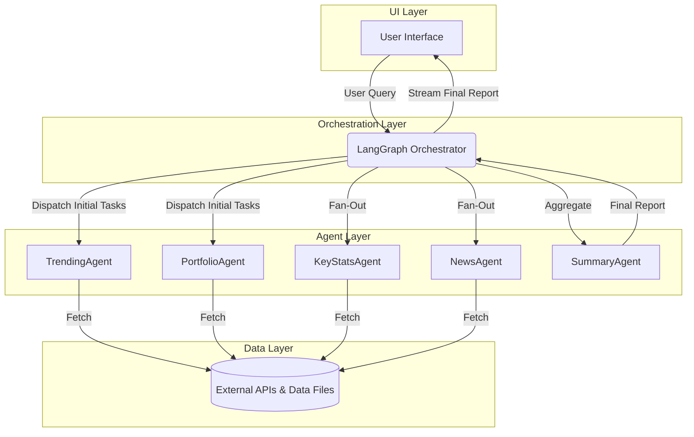

# MCP Trading Bot

LLM agent for market research and trading.

## Overview

This project is an AI-powered market research assistant that leverages a multi-agent system to provide comprehensive analysis of financial markets. It can analyze market trends, assess portfolio performance, gather key statistics, and consolidate news to generate a cohesive summary for the user. The system is built using LangGraph for orchestration and a suite of specialized agents for data collection and analysis.

## Architecture

The application is designed with a multi-layered architecture to separate concerns and enhance modularity.



### The Agent Layer

The core of this application is a team of specialized AI agents that work together to fulfill the user's request. The LangGraph orchestrator manages the workflow, ensuring that agents are called in the correct order and that data flows smoothly between them.

Here are the agents involved:

1.  **TrendingAgent (`fetch_trending_stocks_node`)**
    -   **Role**: Identifies stocks that are relevant to the user's query.
    -   **Action**: Kicks off the workflow by finding trending stocks based on the initial prompt.

2.  **PortfolioAgent (`fetch_portfolio_holdings_node`)**
    -   **Role**: Gathers information about the user's existing investments.
    -   **Action**: Runs in parallel with the `TrendingAgent` to load the user's portfolio from `portfolio.json`.

3.  **KeyStatsAgent (`fetch_key_stats_node`)**
    -   **Role**: Collects key financial metrics for the identified stocks.
    -   **Action**: Fetches statistics (e.g., P/E ratio, market cap) for both trending and portfolio stocks in parallel to speed up the process.

4.  **NewsAgent (`fetch_news_node`)**
    -   **Role**: Gathers the latest news for each stock.
    -   **Action**: Runs in parallel with the `KeyStatsAgent`, fetching and summarizing recent news articles for all relevant stocks.

5.  **SummaryAgent (`generate_summary_node`)**
    -   **Role**: The final assembler of the report.
    -   **Action**: Once all the other agents have completed their tasks, this agent takes all the collected data—trending stocks, portfolio analysis, key stats, and news—and generates a single, cohesive report.

### Workflow Orchestration

The `orchestrator.py` script uses LangGraph to define and execute the workflow. The process is as follows:

1.  **Initiation**: The graph starts with two parallel tasks:
    -   `fetch_trending_stocks`: Identifies trending stocks based on the user's query.
    -   `fetch_portfolio_holdings`: Loads the user's current portfolio.

2.  **Fan-Out Data Collection**: Once the initial stock lists are ready, the orchestrator fans out to collect detailed information in parallel:
    -   `fetch_key_stats`: Gathers financial statistics for all identified stocks.
    -   `fetch_news`: Fetches and summarizes the latest news for the same stocks.

3.  **Aggregation and Summary**: After all data collection is complete, the `generate_summary` node is triggered. This final node aggregates all the information—trending stocks, portfolio data, key stats, and news—to produce a comprehensive report.

This parallelized, multi-step approach ensures that the analysis is both thorough and efficient.

## Getting Started

### Prerequisites

- Python 3.10+
- Pip for package management

### Installation

1.  **Clone the repository:**
    ```bash
    git clone <your-repo-url>
    cd mcp-trading
    ```

2.  **Create and activate a virtual environment:**
    ```bash
    python3 -m venv venv
    source venv/bin/activate
    ```

3.  **Install the dependencies:**
    ```bash
    pip install -r requirements.txt
    ```

### Running the Application

The primary way to run the research workflow is through the web interface, which provides a real-time, interactive experience.

### Running the Web Interface

This project also includes a web interface to provide a more interactive experience. The web server is built with FastAPI and uses Server-Sent Events (SSE) to stream the analysis results in real-time.

1.  **Start the server:**

    ```bash
    python server.py
    ```

2.  **Open your browser:**

    Navigate to [http://localhost:8000](http://localhost:8000). You will see a simple interface where you can input your research query.

#### How it Works

-   **`server.py`**: This script launches a FastAPI web server that serves the main `index.html` page.
-   **`templates/index.html`**: This file contains the HTML and JavaScript for the user interface. It sends the user's query to the `/stream-analysis` endpoint.
-   **Server-Sent Events (SSE)**: The `/stream-analysis` endpoint maintains an open connection to the browser and streams updates as they are generated by the agentic workflow. This allows you to see the analysis unfold in real-time.
-   **`mcp_server.py`**: This script runs a separate server that exposes the individual agent functionalities as tools via the Model Context Protocol (MCP). While not directly used by the web interface, it's a core component for more advanced integrations and direct tool-based interactions.

## Sample Prompts

Here are a few examples of prompts you can use to get started. You can copy and paste these directly into the web interface or use them with the command-line script.

### High-Risk, Short-Term

```
I am looking to invest 100k for 6 months. I have a very high risk tolerance. I would like to see mix of growth and dividend stocks from different sectors and industries.
```

```
I have a high risk tolerance and would like to invest 50K for the duration of 6 months. I am looking for mix of growth and dividend stocks.
```

### Low-Risk, Long-Term

```
I would like to invest 100K for 2 years horizon in a low risk high dividend stocks. I would like to diversify investment across different industries.
```

```
Analyze the current state of the renewable energy sector. I have a moderate risk tolerance and a 5-year investment horizon.
```

### Sector & Stock Specific

```
What are the top-performing tech stocks over the last quarter? I'm interested in large-cap companies.
```

```
I want to invest in healthcare stocks, but I want to avoid pharmaceutical companies. What are my options?
```

```
Provide a comparative analysis between NVDA and AMD.
```

